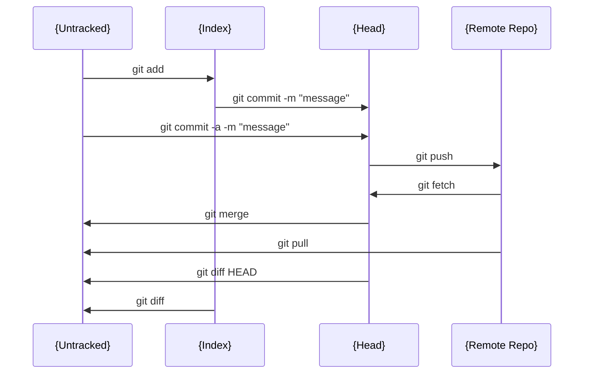

### シーケンス図

#### ファイルステータスの説明

| Status        | 説明                                      |
| ------------- | ----------------------------------------- |
| {Untracked}   | バージョン管理下に置かれていない          |
| {Index}       | 変更されたファイルのステージング状態      |
| {Head}        | ローカルリポジトリ                        |
| {Remote Repo} | リモートリポジトリ (サーバーにて管理され) |
