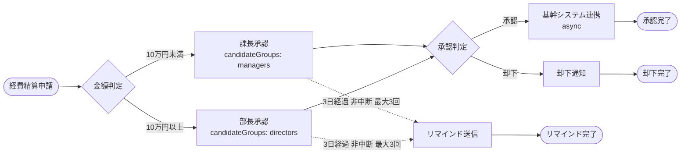

## はじめに

稟議・経費精算・休暇申請といった「承認フロー」は、どの業務システムにも出てきます。そして最初は必ず `status` カラムと `if` 文で作られます。

それで動くのですが、**業務側から次の要望が来た瞬間に破綻します**。

- 「10万円を超えたら部長承認にしてほしい」
- 「3日放置されている申請を督促してほしい」
- 「承認されたら基幹システムへ自動で飛ばしてほしい。ただし基幹が落ちていても承認は消えないでほしい」
- 「監査対応で、誰がいつ何を承認したか全部出してほしい」

これらは全部「ステータス遷移」ではなく**プロセスの話**です。ワークフローエンジンはこの領域のために存在します。

本記事では、[Flowable](https://www.flowable.com/) 8 + Spring Boot で経費精算の承認ワークフローを実装したサンプルを題材に、**業務要件を BPMN のどの要素に対応づけたのか**、そして**その選択が運用上どういう意味を持つのか**を整理します。

サンプルコードは以下に置いてあります。

- [gekal-study-spring/spring-boot-flowable-approval-sample](https://github.com/gekal-study-spring/spring-boot-flowable-approval-sample)

## 題材とした業務要件

経費精算という、どこの会社にもある業務を題材にしました。要件は以下の4つです。

| # | 業務要件 | 業務側の意図 |
| --- | --- | --- |
| 1 | 10万円未満は課長承認、10万円以上は部長承認 | 決裁権限規程。金額で決裁者が変わる |
| 2 | 承認されたら基幹システムへ自動連携する | 二重入力をなくす。伝票番号を採番して申請に紐づける |
| 3 | 却下したら申請者へ通知する | 理由が分からないと再申請できない |
| 4 | 3日放置されたら督促する（最大3回） | 承認待ちの滞留は月次締めに直結する |

一見どれも小さな要件ですが、**それぞれ性質がまったく違います**。1 は分岐、2 は外部連携と再実行、3 は通知、4 は時間経過そのものが引き金です。`if` 文で書くと 4 だけが異物になり、バッチを別に立てる羽目になります。

## 業務要件と BPMN 要素の対応

BPMN 2.0 には、上の性質の違いに対応する語彙が最初から用意されています。今回の対応づけは以下のとおりです。

| 業務要件 | BPMN 要素 | 対応する ID |
| --- | --- | --- |
| 申請の起票 | Start Event（`flowable:initiator`） | `startExpenseRequest` |
| 金額による決裁者の振り分け | Exclusive Gateway | `gatewayAmountCheck` |
| 課長・部長の承認 | User Task（`candidateGroups`） | `userTaskManagerApproval` / `userTaskDirectorApproval` |
| 3日放置の督促 | Boundary Timer Event（非中断型） | `timerManagerReminder` / `timerDirectorReminder` |
| 承認後の基幹連携 | Service Task（非同期） | `serviceTaskErpIntegration` |
| 却下通知 | Service Task | `serviceTaskRejectNotification` |

図にすると次のようになります。



ここから、業務の観点で押さえておきたいポイントを要件ごとに見ていきます。

## 1. 決裁権限規程はどこに置くか

「10万円以上は部長承認」は、BPMN の分岐条件にそのまま書けます。

```xml
<sequenceFlow id="flowAmountToDirector" name="10万円以上"
              sourceRef="gatewayAmountCheck" targetRef="userTaskDirectorApproval">
  <conditionExpression xsi:type="tFormalExpression">
    <![CDATA[${amount >= 100000}]]>
  </conditionExpression>
</sequenceFlow>
```

これは動きますが、**やめたほうがいい**というのが今回の結論です。理由は業務側にあります。

決裁権限規程の「10万円」は、BPMN の分岐だけに出てくる数字ではありません。申請画面の「この申請は部長承認になります」という案内、承認者一覧のフィルタ、月次の集計と、**アプリケーションの各所から同じ規程を参照します**。BPMN に直書きすると、規程が改定されたときに BPMN と Java の両方を直すことになり、片方だけ直して食い違う事故が起きます。

そこで、規程をドメインサービスに一本化し、BPMN からはその Bean を呼ぶだけにしました。

```java
/**
 * 経費精算の承認ルーティング規程。
 * BPMN の分岐条件もこのクラスを呼び、閾値の定義をここ1箇所に閉じ込める。
 */
public class ExpenseApprovalPolicy {

  /** 部長承認が必要になる金額の下限（円）。 */
  public static final long DIRECTOR_APPROVAL_THRESHOLD_YEN = 100_000L;

  /** BPMN の Exclusive Gateway から呼ばれる判定。 */
  public boolean requiresDirectorApproval(long amountYen) {
    return amountYen >= DIRECTOR_APPROVAL_THRESHOLD_YEN;
  }
}
```

```xml
<conditionExpression xsi:type="tFormalExpression">
  <![CDATA[${expenseApprovalPolicy.requiresDirectorApproval(amount)}]]>
</conditionExpression>
```

`expenseApprovalPolicy` は Spring Bean 名です。Flowable の式は Spring のコンテキストから Bean を解決できるため、**BPMN 側には「規程を判定する」という事実だけが残り、閾値は残りません**。

> ドメイン層に Spring のアノテーションを持ち込みたくなかったので、`@Component` ではなく `@Configuration` クラスの `@Bean` メソッドで公開しています。このとき **Bean 名と BPMN の式が一致していないと、実行時まで気付けません**。

もうひとつ実務的な話として、Exclusive Gateway には `default` を必ず指定しておくのがよいです。

```xml
<exclusiveGateway id="gatewayAmountCheck" name="金額判定" default="flowAmountToManager"/>
```

条件をすべて外れたときの行き先が決まっていないと、Flowable は例外を投げてプロセスが止まります。業務的には「どの条件にも当てはまらない申請が来たので処理を停止した」という最悪の状態です。既定ルート（この場合は課長承認）を決めておけば、想定外の値でも承認フロー自体は回ります。

## 2. 承認タスクは「誰に」ではなく「どのグループに」割り当てる

承認タスクの割り当て方には、`assignee`（個人指定）と `candidateGroups`（グループ指定）の2つがあります。今回は後者を選びました。

```xml
<userTask id="userTaskManagerApproval" name="課長承認"
          flowable:candidateGroups="managers"/>
```

業務の観点では、これは**「課長が休んだら承認が止まるか」**という問題です。個人を指定すると、その人が不在の間、申請は誰にも処理できません。グループ宛てにしておけば、同じグループの誰でも処理できます。

グループ宛てのタスクは、承認者が処理する直前に**引き受け（claim）**て自分のものにします。

```java
if (task.getAssignee() == null) {
  // 候補グループ宛てのタスクは、完了前に引き受けて担当者を履歴に残す
  taskService.claim(taskId, approverId);
}
```

claim には2つの意味があります。ひとつは**排他制御**で、2人の課長が同時に開いても、先に claim した側だけが処理できます。もうひとつは**監査証跡**で、「誰が承認したか」が履歴に残ります。グループ宛てのまま完了させると、実施者が記録されません。

アプリケーション側では、claim 済みのタスクを別の人が処理しようとしたら弾いています。

```java
if (!task.isOperableBy(command.approverId())) {
  throw new ApprovalNotPermittedException(
      "このタスクは既に " + task.assignee() + " が引き受けています: " + command.taskId());
}
```

## 3. 督促は「業務を止めない」督促でなければならない

「3日放置されたらリマインドを送る」は、Boundary Timer Event（境界タイマー）で表現します。ここで最も重要な属性が `cancelActivity` です。

```xml
<boundaryEvent id="timerManagerReminder" name="3日経過リマインド"
               attachedToRef="userTaskManagerApproval" cancelActivity="false">
  <timerEventDefinition>
    <timeCycle>R3/P3D</timeCycle>
  </timerEventDefinition>
</boundaryEvent>
```

| 設定 | 挙動 | 業務上の意味 |
| --- | --- | --- |
| `cancelActivity="true"`（既定） | タイマー発火時に承認タスクを**キャンセル**する | 「3日経ったら承認をなかったことにする」。タイムアウトでの自動却下やエスカレーションはこちら |
| `cancelActivity="false"` | 承認タスクを**残したまま**、並行してタイマー側の経路を進める | 「3日経ったら催促する。承認タスクはそのまま」 |

督促は当然 `false` です。既定値が `true` なので、**書き忘れると「3日で申請が消える」システムになります**。ここは業務要件の読み違いが直接事故になる箇所です。

繰り返し回数は ISO 8601 の繰り返し表記で書きます。

```
R3/P3D  →  3日周期で、最大3回
```

`R/P3D`（無限回）にすると、承認されるまで永遠に督促が飛び続けます。実運用では「3回督促して駄目なら上位者へエスカレーション」といった打ち切りルートを用意することになるので、回数は明示しておくべきです。

送信回数はプロセス変数 `reminderCount` に累積させ、申請の状態と一緒に返しています。業務側から「何回催促したか」を聞かれるのは確実なので、最初から持たせておくのが安全です。

```java
Number current = (Number) execution.getVariable(ProcessVariables.REMINDER_COUNT);
int count = (current == null ? 0 : current.intValue()) + 1;
execution.setVariable(ProcessVariables.REMINDER_COUNT, count);
```

> タイマーはエンジンの**非同期エグゼキュータ**が動かします。`flowable.async-executor-activate: false` にすると、リマインドも次章の基幹連携も一切動きません。設定ひとつで督促が止まるので、環境ごとの設定差分には注意が必要です。

## 4. 外部連携が落ちても承認は消えない

「承認されたら基幹システムへ自動連携する」は Service Task ですが、**同期で呼んではいけません**。

```xml
<serviceTask id="serviceTaskErpIntegration" name="基幹システム連携"
             flowable:delegateExpression="${erpIntegrationDelegate}"
             flowable:async="true"
             flowable:exclusive="true"/>
```

`flowable:async="true"` を付けると、Flowable はこの Service Task を**ジョブとして登録し、承認のトランザクションはそこで確定します**。連携処理は非同期エグゼキュータが後から実行し、失敗すれば自動でリトライします。

業務の観点での違いは決定的です。

| 方式 | 基幹システムが落ちていたとき |
| --- | --- |
| 同期（`async` なし） | 例外が承認トランザクションまで伝播し、**ロールバックして承認そのものがなかったことになる**。承認者は「エラーが出た」としか分からず、もう一度承認しに来る |
| 非同期（`async="true"`） | **承認は確定している**。連携ジョブだけが失敗し、リトライ対象として残る。基幹が復旧すれば自動で流れる |

承認という業務判断と、その結果を外部へ届ける処理は、**成否を運命共同体にしてはいけない**というのが要点です。人間が下した判断を、外部システムの都合で取り消してはなりません。

`JavaDelegate` の実装側は、失敗時に例外を投げるだけでよく、リトライの面倒はエンジンが見ます。

```java
@Component
public class ErpIntegrationDelegate implements JavaDelegate {

  /** BPMN の flowable:field から注入される連携先キー。 */
  private Expression endpointKey;

  @Override
  public void execute(DelegateExecution execution) {
    String endpoint = endpointKey == null ? "-" : (String) endpointKey.getValue(execution);
    // ... 基幹システムへの連携（サンプルではログ出力と伝票番号の採番）
    execution.setVariable(ProcessVariables.ERP_VOUCHER_NO, voucherNo);
  }

  public void setEndpointKey(Expression endpointKey) {
    this.endpointKey = endpointKey;
  }
}
```

> `flowable:field` の値は `String` ではなく `Expression` 型の setter で受けます。`delegateExpression` で解決される Bean は**シングルトン**なので、注入された値をフィールドに保持したまま使い回すと、別のプロセスインスタンスの値と混ざります。`execute()` の中で `getValue(execution)` して解決するのが正しい使い方です。

## 5. 監査証跡は「変数」ではなく「タスク」に紐づける

「誰がいつ何を承認したか」は、監査対応で必ず要求されます。Flowable は履歴テーブルに一通り記録してくれるので、`history-level` を `audit` 以上にしておけば、あとは組み立てるだけです。

```yaml
flowable:
  # 履歴からプロセス変数を引くため audit 以上が必要
  history-level: audit
```

出力はこうなります。

```
[申請]     経費精算申請          23:02:30 → 23:02:30
[承認]     課長承認  実施者: sato  23:02:30 → 23:02:34 / 所要 3.4 秒
             └ 「領収書を確認しました」 sato
[自動処理] リマインド送信（課長）  23:02:31 → 23:02:31
[自動処理] 基幹システム連携        23:02:34 → 23:02:34
```

ここで設計上の判断がひとつあります。**承認コメントをプロセス変数に入れるか、タスクコメントに入れるか**です。

素直に書くと、承認コメントはプロセス変数になります。

```java
variables.put(ProcessVariables.APPROVAL_COMMENT, comment);
```

しかしプロセス変数は**プロセスインスタンスに1つ**しかありません。多段承認（課長 → 部長）や差戻しを追加した瞬間、後の承認者のコメントが前のコメントを上書きします。監査証跡としては壊れています。

そこで、コメントは Flowable のタスクコメント（`ACT_HI_COMMENT`）として残しました。

```java
if (comment != null && !comment.isBlank()) {
  // 履歴として各段階のコメントを残す。プロセス変数だけだと多段承認や差戻しで上書きされてしまう
  taskService.addComment(taskId, task.getProcessInstanceId(), comment);
}
```

プロセス変数 `approvalComment` も残していますが、用途は**「直近の判断内容」だけ**に限定し、却下通知の Service Task が読むためのものと割り切っています。**履歴はタスク側、判断の受け渡しは変数側**という住み分けです。

もう一点、履歴の組み立てで実務的なのは**ノイズの除去**です。`ACT_HI_ACTINST` には sequenceFlow やゲートウェイまで全部残るため、そのまま出すと人間には読めません。

```java
/** 履歴として表示する BPMN のアクティビティ種別。 */
private static final Set<String> VISIBLE_ACTIVITY_TYPES =
    Set.of("startEvent", "userTask", "serviceTask");
```

境界タイマーの行も除外しています。タイマーの履歴は「待機していた期間」を表す行であって、発火の事実は「リマインド送信」の Service Task 側に出るためです。両方出すと同じ出来事が二重に見えます。

> 変数の**変更履歴**まで必要なら `history-level` を `full` に上げます（`ACT_HI_DETAIL` が増える）。ただし履歴テーブルは放っておくと肥大化するので、クリーンアップやアーカイブの方針とセットで決めてください。承認ワークフローの履歴は「消してよい」と言われにくいデータなので、容量計画は早めにやったほうがよいです。

## 6. 「今どこで止まっているか」を見せる

承認ワークフローで最も多い問い合わせは「私の申請は今どこですか」です。ステータス文字列だけだと答えになりません。

Flowable は履歴から「実行中のアクティビティ」「通過済みのアクティビティ」「通過したシーケンスフロー」を引けるので、BPMN の XML と一緒に返せば、画面側でフロー図の上に進捗を塗れます。

```java
return new ProcessDiagram(
    readBpmnXml(instance.getProcessDefinitionId()),
    // 実行中（終了時刻がない）
    activities.stream().filter(a -> a.getEndTime() == null) /* ... */ .toList(),
    // 通過済み
    activities.stream().filter(a -> a.getEndTime() != null) /* ... */ .toList(),
    // 通過したシーケンスフロー
    activities.stream().filter(a -> SEQUENCE_FLOW.equals(a.getActivityType())) /* ... */ .toList());
```

**画像はサーバで生成していません。** Flowable には `flowable-image-generator` という画像生成機能があり、サーバ側で PNG を吐けます。ただしこれを使うと、日本語ラベルを描画するためのフォントをコンテナイメージに入れる必要があり、さらに**図の見た目を変えるたびにサーバの再デプロイが必要**になります。XML と進捗だけ返して描画は画面（bpmn-js）に任せるほうが、運用上ずっと軽くなります。

## 運用面で効いてくる設定

業務システムとして動かすときに、後から効いてくる設定をいくつか挙げておきます。

### スキーマの所有者を決める

Flowable は起動時に自分でテーブルを作れますが、今回は切っています。

```yaml
flowable:
  # スキーマの作成・更新は Flyway が担当するため、アプリ起動時には一切変更させない
  database-schema-update: false
```

Flowable のテーブル定義は公式スクリプトが jar に同梱されているので、それを Flyway の `V` ファイルとして取り込み、**スキーマの所有者を Flyway に一本化**しました。この状態でマイグレーション未実行のまま起動すると、Flowable はスキーマ不一致で起動に失敗します。これは意図した挙動です。本番で「アプリが勝手にテーブルを変更する」状態は避けたいので、起動失敗のほうがましです。

Flowable をバージョンアップするときは、公式の upgrade スクリプトを新しい `V` ファイルとして追加します（既存ファイルは書き換えない）。

### 非同期ジョブを外側のトランザクションで包まない

これは実際にハマった箇所です。`ManagementService.executeJob()` は、**プロセスインスタンスの排他ロックを自分で取得・解放します**。これを Spring の `@Transactional` で包むと、ロックが解放されないまま残り、以降の非同期 Service Task が `Could not lock process instance` で永久に実行されなくなります。

```java
/**
 * ジョブ実行はワークフローエンジンが自前のトランザクションで制御する。
 * ここで @Transactional を付けて外側のトランザクションに巻き込むと、
 * ロックが解放されないまま残り、以降の非同期ジョブが永久に実行できなくなるため、意図的に付けていない。
 */
@Service
public class ReminderTriggerService {
  // @Transactional は付けない
}
```

業務影響としては「督促も基幹連携も、ある時点から静かに全部止まる」という、最も気付きにくい形の障害になります。

### 動作確認用のエンドポイントは業務用途と分ける

「3日待たないとリマインドの確認ができない」のは開発上つらいので、タイマーを即座に期限切れにするエンドポイントを用意しました。

```
POST /api/demo/reminders/{processInstanceId}
```

実装はタイマージョブを実行可能ジョブへ移送するだけです。移送後の実行はエンジンに任せます（自分でも実行すると二重処理で `FlowableOptimisticLockingException` になります）。

当然ながらこれは**動作確認専用**で、業務環境では公開しません。パスを `/api/demo/**` に分けてあるのは、そこで線を引くためです。

## テストで何を担保するか

承認ワークフローのテストは、レイヤーごとに担保する対象を分けました。

| テスト | 方式 | 担保する対象 |
| --- | --- | --- |
| `ExpenseApprovalPolicyTest` | 素の JUnit | 承認ルーティングの**境界値**（99,999円と100,000円） |
| `ApprovalTaskServiceTest` | Mockito | ユースケースの規則（引き受け済みタスクの排他、却下コメント必須） |
| `ExpenseApprovalProcessTest` | `@SpringBootTest`（非同期エグゼキュータ**停止**） | プロセス全体の分岐・承認・却下・リマインド |
| `AsyncJobExecutionTest` | `@SpringBootTest`（非同期エグゼキュータ**稼働**） | 非同期ジョブが実際に実行されること |

プロセスのテストでは非同期エグゼキュータを**意図的に停止**し、ジョブを手動実行しています。エグゼキュータが動いていると「いつ実行されるか分からない」ため、テストが不安定になるからです。

一方で、それだけだと「非同期ジョブがそもそも実行されない」という退行を検知できません。そのため、エグゼキュータを稼働させた状態で実際に実行されることを確かめるテストを別に用意しています。前述の `Could not lock process instance` は、まさにこの形でしか捕まらない種類の不具合です。

## このサンプルで割り切った点

実案件に持っていくなら、次はここを埋めることになります。

- **却下後の再申請（差戻しループ）** — 現状は却下で終了する。実務では申請者へ差し戻して修正・再提出させるループが要る
- **承認者不在時のエスカレーション** — 3回督促した後の上位者への自動エスカレーション
- **代理承認** — 承認者が不在のときの代理設定
- **認証** — HTTP Basic + インメモリユーザー。実案件では OAuth2 リソースサーバ（JWT）へ
- **候補グループ** — Spring Security の権限文字列で表現し、Flowable の IDM テーブルは使っていない。組織構造が複雑なら IDM か外部の組織マスタとの連携を検討する
- **通知・基幹連携** — `JavaDelegate` からのログ出力のみ

## まとめ

承認ワークフローをワークフローエンジンで作る利点は、「ステータス管理が楽になること」ではありません。**業務要件の性質の違いを、そのまま表現できること**です。

| 業務要件 | 表現方法 | 業務観点での勘所 |
| --- | --- | --- |
| 決裁権限規程 | Exclusive Gateway + ドメインサービス | 閾値を BPMN に埋めない。`default` を必ず指定する |
| 承認の割り当て | `candidateGroups` + claim | 個人指定は不在で止まる。claim で排他と実施者記録を両立 |
| 滞留の督促 | 非中断型 Boundary Timer | `cancelActivity="false"` を書き忘れると申請が消える |
| 外部連携 | 非同期 Service Task | 承認の確定と連携の成否を運命共同体にしない |
| 監査証跡 | 履歴テーブル + タスクコメント | コメントは変数ではなくタスクに紐づける |
| 進捗の可視化 | BPMN XML + 通過済み要素ID | 画像はサーバで作らない |

要件を BPMN の語彙に翻訳する段階で、業務側と「これはタスクを消す督促ですか、消さない督促ですか」と会話できるのが、このアプローチの一番の価値だと感じています。

## 参考

- [Flowable 公式ドキュメント](https://www.flowable.com/open-source/docs/)
- [BPMN 2.0 仕様（OMG）](https://www.omg.org/spec/BPMN/2.0/)
- [gekal-study-spring/spring-boot-flowable-approval-sample](https://github.com/gekal-study-spring/spring-boot-flowable-approval-sample)
