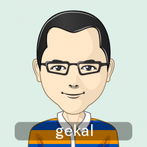

# 僕、だれ

ニックネームがgekalです。  
初めに、英語を勉強した時、この単語の発音が名前の発音と類似するかと思いました。

2011年卒業から、ずーっと、プログラミングの仕事をやってました。派遣会社の社員なので、開発言語を選ばれませんでした。お陰で、色んな開発言語を触りました。

* Java
* JavaScript
* Dotnet
* VBA
* Bash
* Groovy

オープンが好きなため、今後、OSSをメインに勉強して、プロジェクトに活用するか思います。

> これが僕の似顔ですよ。

# 直近

最近、クラウドとコンテナーに興味がすごく有りました。それで、AWSとDockerを夢中に勉強中です。
